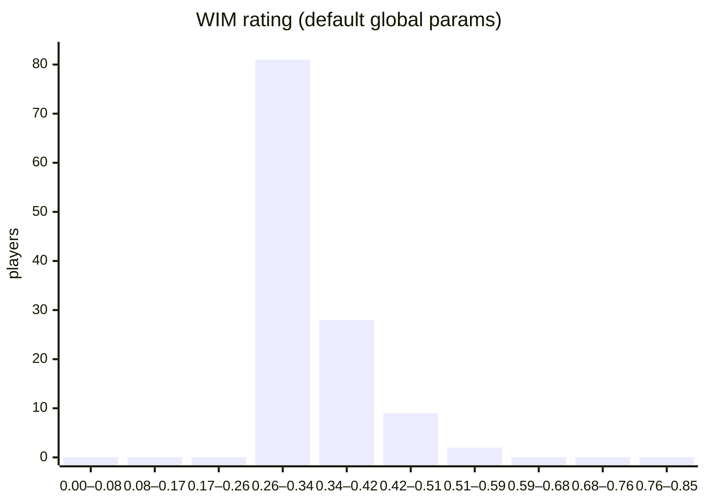
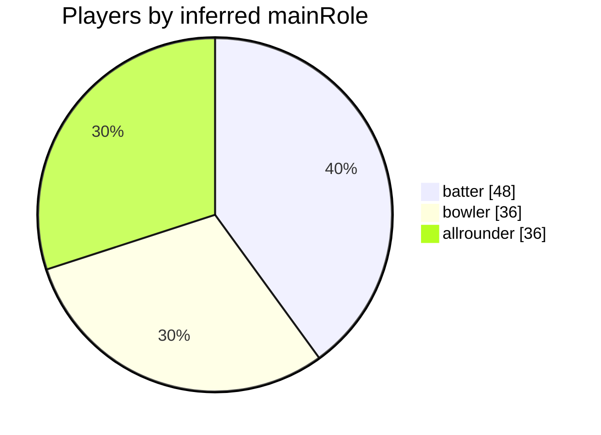
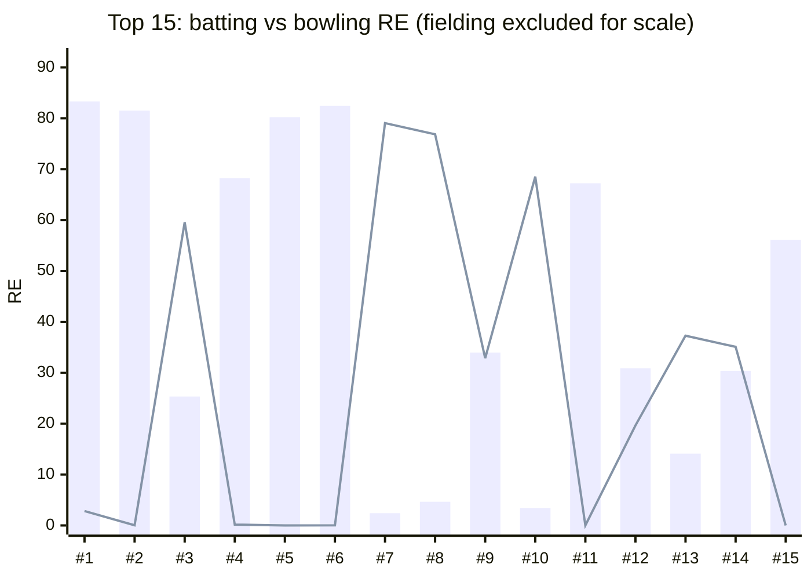
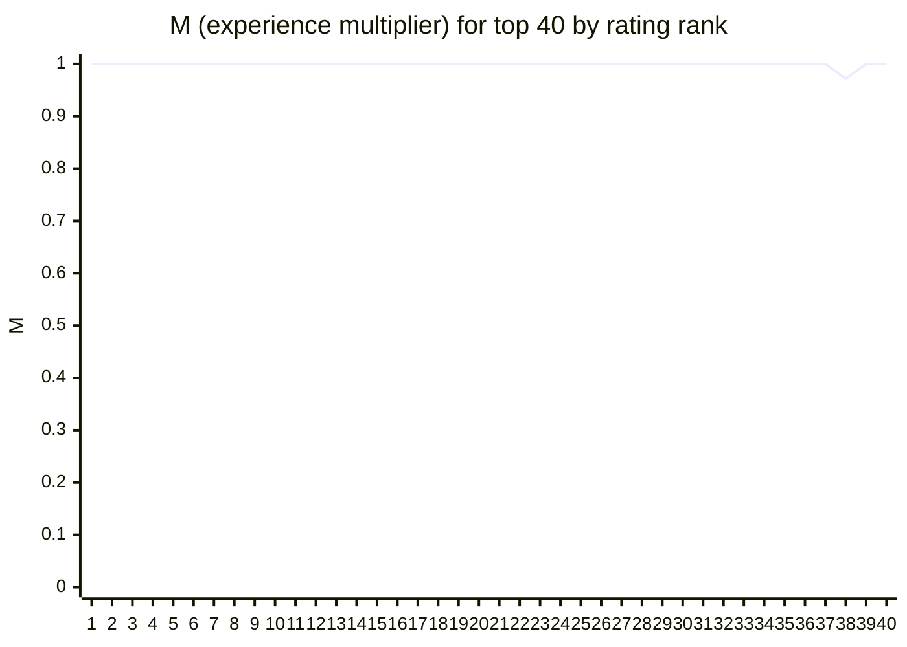
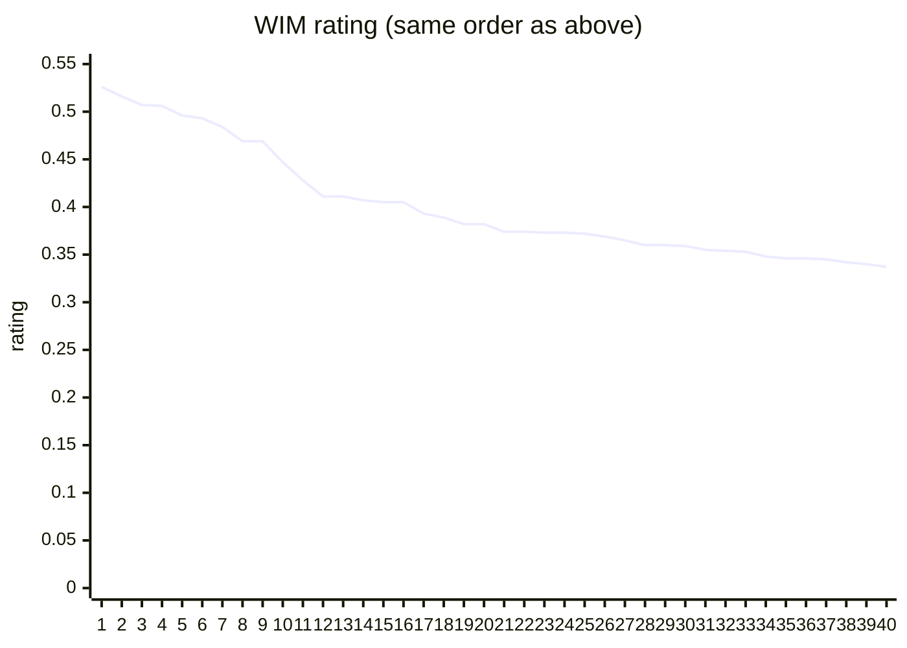

# WIM model test report (real ODI data)

This report tests the **WIM v5** equations in `equation.tex` using `computeWim` from `src/lib/wim.ts` with `defaultGlobal()` from `src/lib/defaults.ts` (includes `ratingPerMatchBonus` on career matches).

## Data source

- **Cricsheet** male ODI ball-by-ball JSON ([cricsheet.org](https://cricsheet.org/)), aggregated to career totals per player registry id.
- **Coverage:** 2516 ODI matches; players included below have **≥25** matches and either **≥200 runs** or **≥15 wickets** (career, in this dataset).
- **Caveats:** Bowling runs use batter runs + wides + no-balls per ball (leg-byes/byes excluded). Match count = appearances in official XI in each file. Fielding credits: catches as listed; run-outs split **1/n** across *n* fielders on the dismissal.

---

## Parameters required to evaluate the model

### Per-player inputs (`WimPlayerStats` — map from notation in `equation.tex`)

| Symbol / concept | Code field | Notes |
|------------------|------------|--------|
| Career matches | `matches` | \(M_{\mathrm{ch}}\) in \(M\) |
| Batting runs | `R` | |
| Batting dismissals | `dismissals` | “Out” for \(r_a\) |
| Balls faced | `BF` | For \(r_s\) |
| Wickets | `wickets` | \(W\); drives \(\Sigma\), \(R^{(f)}_{pw}\)-style terms |
| Runs conceded (bowling) | `runsConceded` | With estimated balls bowled \(BB = 22 \times \text{wickets}\) |
| Catches | `catches` | Fielding numerator |
| Run-outs (fractional OK) | `runouts` | Fielding numerator |
| Primary role | `mainRole` | `batter` / `bowler` / `allrounder` (scales non-primary discipline by 0.98) |

### Global tuning parameters (`WimGlobalParams` / defaults)

Baselines \(\text{Base}^\*\), winsor bounds \(\ell_b,h_b,\ell_w,h_w,\ell_f,h_f\), \(B_{\min}\) (`Bmin`, \(\lambda_{bb}\)), `bowlingSigmaWorkloadMinBalls` (\(N_{\min}^{\mathrm{wl}}\) in \(\omega_\Sigma\) on Bowl_RE only), \(\rho_{\mathrm{thresh}}\), \(\epsilon\), \(C_{\mathrm{legend}}\), **`ratingPerMatchBonus`** (\(b_m\), additive per raw `matches` before outer \(\min(1,\cdot)\)), \(R^{(f)}_{pw}\) as `rpw`, field scale, expected catches/run-outs per match, \(\gamma_M,\gamma_\lambda,\gamma_f\), \(\beta\) as `batGeoWeight`, \(\Sigma\) weights, wicket knee, and softplus elite \((\tau,\delta,B_{\max},s)\) for bat and bowl — see `src/lib/defaults.ts` for numeric values used here.

---

## Summary (120 players)

| Metric | Value |
|--------|------:|
| Mean WIM rating | 0.3362 |
| Median | 0.3178 |
| Min / Max | 0.2774 / 0.5260 |
| Batters / Bowlers / All-rounders (inferred) | 48 / 36 / 36 |

### Rating distribution (histogram)



### Inferred main role mix



### Top 15 by rating (bat RE vs bowl RE; x = rank within this table)



| # | Player | BatRE | BowlRE |
|---|--------|------:|-------:|
| 1 | DJ Mitchell | 83.30 | 2.84 |
| 2 | V Kohli | 81.53 | 0.03 |
| 3 | A Flintoff | 25.34 | 59.58 |
| 4 | AB de Villiers | 68.25 | 0.16 |
| 5 | Shubman Gill | 80.22 | 0.00 |
| 6 | DJ Malan | 82.45 | 0.03 |
| 7 | MA Starc | 2.41 | 79.06 |
| 8 | S Lamichhane | 4.65 | 76.86 |
| 9 | BJ McMullen | 33.98 | 32.86 |
| 10 | B Lee | 3.43 | 68.53 |
| 11 | Babar Azam | 67.24 | 0.00 |
| 12 | MG Erasmus | 30.87 | 19.64 |
| 13 | DJ Bravo | 14.10 | 37.28 |
| 14 | Shakib Al Hasan | 30.35 | 35.10 |
| 15 | Q de Kock | 56.12 | 0.00 |

### Experience cap \(M\) and final rating by rank (top 40)





---

## Full results table (120 players)

| Rank | Player | Mat | R | Out | BF | Wkts | Runs conc. | Ct | RO | Role | Rating | BatRE | BowlRE | FieldRE | M |
|-----:|--------|----:|--:|---:|---:|-----:|-----------:|---:|---:|------|-------:|------:|-------:|--------:|--:|
| 1 | DJ Mitchell | 58 | 2689 | 45 | 2803 | 14 | 335 | 39 | 0 | batter | 0.5260 | 83.30 | 2.84 | 18.00 | 1.000 |
| 2 | V Kohli | 308 | 14675 | 251 | 15652 | 5 | 680 | 164 | 9.83 | batter | 0.5164 | 81.53 | 0.03 | 20.69 | 1.000 |
| 3 | A Flintoff | 83 | 2168 | 60 | 2377 | 119 | 2676 | 25 | 3 | allrounder | 0.5070 | 25.34 | 59.58 | 15.46 | 1.000 |
| 4 | AB de Villiers | 222 | 9435 | 175 | 9323 | 7 | 202 | 174 | 25.33 | batter | 0.5061 | 68.25 | 0.16 | 31.80 | 1.000 |
| 5 | Shubman Gill | 61 | 2953 | 53 | 2982 | 0 | 25 | 40 | 0.5 | batter | 0.4960 | 80.22 | 0.00 | 18.00 | 1.000 |
| 6 | DJ Malan | 29 | 1418 | 25 | 1449 | 1 | 17 | 11 | 0.5 | batter | 0.4935 | 82.45 | 0.03 | 15.23 | 1.000 |
| 7 | MA Starc | 126 | 579 | 49 | 748 | 239 | 5661 | 46 | 1 | bowler | 0.4835 | 2.41 | 79.06 | 14.27 | 1.000 |
| 8 | S Lamichhane | 62 | 472 | 30 | 527 | 129 | 2511 | 10 | 2.5 | bowler | 0.4694 | 4.65 | 76.86 | 11.42 | 1.000 |
| 9 | BJ McMullen | 37 | 1202 | 29 | 1365 | 55 | 1216 | 22 | 2.5 | allrounder | 0.4691 | 33.98 | 32.86 | 26.04 | 1.000 |
| 10 | B Lee | 154 | 865 | 50 | 1057 | 257 | 6139 | 46 | 6.83 | bowler | 0.4474 | 3.43 | 68.53 | 16.61 | 1.000 |
| 11 | Babar Azam | 134 | 6203 | 115 | 7066 | 0 | 0 | 61 | 2 | batter | 0.4276 | 67.24 | 0.00 | 17.41 | 1.000 |
| 12 | MG Erasmus | 60 | 2031 | 55 | 2652 | 48 | 1232 | 31 | 6 | allrounder | 0.4112 | 30.87 | 19.64 | 30.90 | 1.000 |
| 13 | DJ Bravo | 146 | 2760 | 108 | 3398 | 177 | 5213 | 68 | 14 | bowler | 0.4105 | 14.10 | 37.28 | 29.91 | 1.000 |
| 14 | Shakib Al Hasan | 211 | 6638 | 174 | 7930 | 258 | 8139 | 55 | 9 | allrounder | 0.4067 | 30.35 | 35.10 | 15.09 | 1.000 |
| 15 | Q de Kock | 159 | 7014 | 151 | 7248 | 0 | 0 | 207 | 8.67 | batter | 0.4050 | 56.12 | 0.00 | 24.08 | 1.000 |
| 16 | TA Boult | 111 | 216 | 24 | 279 | 206 | 5075 | 46 | 1.33 | bowler | 0.4049 | 1.02 | 63.24 | 15.91 | 1.000 |
| 17 | KL Rahul | 91 | 3270 | 64 | 3596 | 0 | 0 | 80 | 7.5 | batter | 0.3931 | 49.57 | 0.00 | 28.26 | 1.000 |
| 18 | Mohammed Shami | 106 | 224 | 28 | 271 | 200 | 4865 | 32 | 0 | bowler | 0.3893 | 1.15 | 63.78 | 12.16 | 1.000 |
| 19 | SR Watson | 164 | 5357 | 128 | 5844 | 146 | 4663 | 58 | 3.5 | allrounder | 0.3822 | 35.44 | 25.24 | 14.99 | 1.000 |
| 20 | MG Johnson | 147 | 934 | 57 | 976 | 226 | 5790 | 34 | 7.5 | bowler | 0.3819 | 4.10 | 56.16 | 15.36 | 1.000 |
| 21 | SS Iyer | 75 | 2952 | 64 | 2997 | 0 | 39 | 32 | 4.83 | batter | 0.3745 | 50.27 | 0.00 | 23.88 | 1.000 |
| 22 | HM Amla | 177 | 7834 | 161 | 8861 | 0 | 0 | 86 | 1.83 | batter | 0.3742 | 56.09 | 0.00 | 18.00 | 1.000 |
| 23 | Fakhar Zaman | 87 | 3803 | 80 | 4067 | 1 | 111 | 42 | 0 | batter | 0.3732 | 55.88 | 0.00 | 18.00 | 1.000 |
| 24 | CR Woakes | 119 | 1514 | 63 | 1683 | 173 | 5111 | 50 | 4.5 | bowler | 0.3726 | 9.63 | 44.47 | 19.68 | 1.000 |
| 25 | MS Dhoni | 331 | 10274 | 200 | 11820 | 1 | 31 | 308 | 46.83 | allrounder | 0.3718 | 41.82 | 0.00 | 31.80 | 1.000 |
| 26 | KC Sangakkara | 298 | 11640 | 252 | 14315 | 0 | 0 | 324 | 26.17 | batter | 0.3686 | 43.91 | 0.00 | 29.07 | 1.000 |
| 27 | KS Williamson | 173 | 7145 | 148 | 8749 | 37 | 1310 | 77 | 5 | batter | 0.3648 | 49.18 | 3.89 | 19.17 | 1.000 |
| 28 | SD Hope | 138 | 5666 | 116 | 6949 | 0 | 0 | 147 | 5.33 | batter | 0.3600 | 49.58 | 0.00 | 21.69 | 1.000 |
| 29 | SR Tendulkar | 146 | 6433 | 134 | 7414 | 27 | 1383 | 45 | 4.5 | batter | 0.3599 | 54.19 | 2.18 | 14.90 | 1.000 |
| 30 | DA Warner | 156 | 6623 | 149 | 6828 | 0 | 8 | 70 | 5 | batter | 0.3587 | 51.27 | 0.00 | 19.76 | 1.000 |
| 31 | RG Sharma | 278 | 11357 | 235 | 12300 | 9 | 533 | 104 | 9 | batter | 0.3551 | 52.88 | 0.11 | 17.33 | 1.000 |
| 32 | H Klaasen | 59 | 2131 | 48 | 1816 | 0 | 33 | 50 | 1.5 | batter | 0.3539 | 50.36 | 0.00 | 19.71 | 1.000 |
| 33 | JE Root | 183 | 7329 | 149 | 8415 | 29 | 1678 | 82 | 0.83 | batter | 0.3529 | 50.96 | 1.87 | 17.04 | 1.000 |
| 34 | JH Kallis | 138 | 4929 | 111 | 6453 | 92 | 3305 | 54 | 2 | allrounder | 0.3482 | 36.92 | 16.81 | 15.22 | 1.000 |
| 35 | F du Plessis | 141 | 5445 | 116 | 6175 | 2 | 189 | 77 | 5.5 | batter | 0.3456 | 46.67 | 0.01 | 21.75 | 1.000 |
| 36 | Saeed Ajmal | 108 | 323 | 46 | 534 | 175 | 4048 | 24 | 2.5 | bowler | 0.3456 | 1.41 | 56.14 | 10.88 | 1.000 |
| 37 | MJ Henry | 93 | 270 | 26 | 290 | 171 | 4232 | 31 | 2 | bowler | 0.3454 | 1.68 | 52.37 | 14.34 | 1.000 |
| 38 | Ishan Kishan | 26 | 886 | 21 | 866 | 0 | 0 | 13 | 2.5 | batter | 0.3423 | 40.25 | 0.00 | 29.48 | 0.972 |
| 39 | MJ Guptill | 194 | 7125 | 174 | 8165 | 4 | 98 | 100 | 17.67 | batter | 0.3402 | 37.72 | 0.07 | 29.56 | 1.000 |
| 40 | AC Gilchrist | 121 | 4355 | 112 | 4153 | 0 | 0 | 186 | 9 | batter | 0.3368 | 39.63 | 0.00 | 27.06 | 1.000 |
| 41 | DW Steyn | 124 | 365 | 39 | 562 | 193 | 5039 | 30 | 6.83 | bowler | 0.3332 | 1.41 | 48.23 | 16.33 | 1.000 |
| 42 | M Muralitharan | 126 | 317 | 43 | 379 | 190 | 4579 | 32 | 4.67 | bowler | 0.3331 | 1.38 | 50.55 | 14.03 | 1.000 |
| 43 | A Symonds | 126 | 3589 | 81 | 3960 | 69 | 2894 | 54 | 6 | allrounder | 0.3329 | 32.70 | 11.78 | 21.43 | 1.000 |
| 44 | BA Stokes | 113 | 3469 | 83 | 3616 | 74 | 3125 | 54 | 1.5 | allrounder | 0.3317 | 34.29 | 13.39 | 18.00 | 1.000 |
| 45 | RT Ponting | 198 | 6979 | 173 | 8481 | 0 | 0 | 95 | 19 | batter | 0.3291 | 34.87 | 0.00 | 30.29 | 1.000 |
| 46 | PD Collingwood | 158 | 4148 | 116 | 5413 | 86 | 3425 | 89 | 14 | allrounder | 0.3286 | 23.50 | 12.38 | 29.19 | 1.000 |
| 47 | IJL Trott | 68 | 2819 | 55 | 3658 | 2 | 166 | 14 | 3 | batter | 0.3283 | 51.49 | 0.02 | 13.48 | 1.000 |
| 48 | KD Mills | 131 | 871 | 52 | 966 | 191 | 5027 | 33 | 3.5 | bowler | 0.3261 | 4.20 | 47.96 | 12.40 | 1.000 |
| 49 | S Dhawan | 166 | 6733 | 153 | 7358 | 0 | 0 | 83 | 2 | batter | 0.3257 | 46.50 | 0.00 | 18.00 | 1.000 |
| 50 | A Vala | 56 | 1783 | 55 | 2557 | 46 | 1308 | 29 | 2 | allrounder | 0.3238 | 25.88 | 16.98 | 21.26 | 1.000 |
| 51 | SPD Smith | 167 | 5668 | 132 | 6522 | 28 | 971 | 89 | 9 | batter | 0.3217 | 36.58 | 3.13 | 23.98 | 1.000 |
| 52 | DL Vettori | 159 | 1450 | 71 | 1703 | 184 | 5254 | 55 | 9.83 | bowler | 0.3216 | 6.18 | 36.70 | 20.80 | 1.000 |
| 53 | Shahid Afridi | 207 | 3913 | 168 | 2878 | 242 | 7950 | 58 | 6.5 | bowler | 0.3212 | 17.33 | 32.23 | 14.05 | 1.000 |
| 54 | HG Munsey | 62 | 2410 | 54 | 2609 | 0 | 0 | 31 | 0.5 | batter | 0.3212 | 45.59 | 0.00 | 18.00 | 1.000 |
| 55 | JM Bairstow | 103 | 3671 | 87 | 3596 | 0 | 0 | 56 | 3.83 | batter | 0.3208 | 42.03 | 0.00 | 21.48 | 1.000 |
| 56 | HT Tector | 49 | 1775 | 38 | 2111 | 2 | 193 | 22 | 2 | batter | 0.3196 | 42.17 | 0.03 | 21.09 | 1.000 |
| 57 | BFW de Leede | 47 | 1155 | 39 | 1593 | 44 | 1438 | 23 | 5 | allrounder | 0.3190 | 19.28 | 12.08 | 31.80 | 1.000 |
| 58 | JM Anderson | 179 | 254 | 33 | 498 | 250 | 7321 | 48 | 12.17 | bowler | 0.3182 | 0.67 | 43.19 | 19.14 | 1.000 |
| 59 | ST Jayasuriya | 135 | 4414 | 127 | 4625 | 89 | 3184 | 24 | 7.83 | allrounder | 0.3181 | 31.67 | 16.69 | 14.63 | 1.000 |
| 60 | ML Hayden | 99 | 3939 | 87 | 4818 | 0 | 0 | 41 | 3.5 | batter | 0.3178 | 43.82 | 0.00 | 19.11 | 1.000 |
| 61 | TM Head | 77 | 2948 | 68 | 2802 | 28 | 1137 | 19 | 1 | batter | 0.3176 | 47.62 | 4.94 | 10.33 | 1.000 |
| 62 | LRPL Taylor | 224 | 8126 | 174 | 9791 | 0 | 35 | 133 | 7.5 | batter | 0.3171 | 41.87 | 0.00 | 20.92 | 1.000 |
| 63 | Haris Sohail | 43 | 1709 | 37 | 1968 | 11 | 583 | 17 | 0.5 | batter | 0.3171 | 46.61 | 0.90 | 15.28 | 1.000 |
| 64 | M Morkel | 116 | 268 | 29 | 354 | 187 | 4700 | 31 | 2.5 | bowler | 0.3166 | 1.20 | 49.35 | 12.14 | 1.000 |
| 65 | Zeeshan Maqsood | 46 | 1196 | 40 | 1813 | 54 | 1500 | 23 | 1.83 | allrounder | 0.3154 | 19.70 | 20.88 | 21.87 | 1.000 |
| 66 | HE van der Dussen | 68 | 2529 | 52 | 2912 | 1 | 3 | 28 | 0 | batter | 0.3151 | 46.54 | 0.03 | 15.83 | 1.000 |
| 67 | DP Conway | 42 | 1672 | 38 | 1908 | 0 | 0 | 20 | 0 | batter | 0.3147 | 44.34 | 0.00 | 17.97 | 1.000 |
| 68 | MJ Clarke | 217 | 6988 | 161 | 8938 | 52 | 1821 | 91 | 14.75 | batter | 0.3131 | 32.90 | 4.91 | 24.17 | 1.000 |
| 69 | Sikandar Raza | 125 | 3662 | 98 | 4134 | 75 | 3442 | 49 | 7 | allrounder | 0.3127 | 28.61 | 11.84 | 21.47 | 1.000 |
| 70 | GJ Maxwell | 144 | 3695 | 116 | 2975 | 74 | 3519 | 94 | 10.5 | allrounder | 0.3122 | 26.79 | 8.19 | 26.84 | 1.000 |
| 71 | SA Edwards | 62 | 1873 | 49 | 2094 | 0 | 0 | 62 | 7 | allrounder | 0.3122 | 30.01 | 0.00 | 31.80 | 1.000 |
| 72 | RA Jadeja | 207 | 2880 | 89 | 3362 | 225 | 8364 | 86 | 12.67 | bowler | 0.3111 | 12.10 | 26.48 | 23.03 | 1.000 |
| 73 | R Ravindra | 38 | 1392 | 33 | 1283 | 20 | 917 | 13 | 0 | allrounder | 0.3106 | 45.18 | 2.81 | 13.50 | 1.000 |
| 74 | JO Holder | 129 | 2144 | 85 | 2395 | 151 | 5602 | 57 | 4.5 | bowler | 0.3102 | 12.88 | 28.57 | 19.96 | 1.000 |
| 75 | SB Styris | 111 | 3184 | 82 | 3906 | 67 | 2497 | 53 | 2.5 | allrounder | 0.3094 | 27.64 | 14.35 | 19.28 | 1.000 |
| 76 | JC Buttler | 194 | 5473 | 138 | 4729 | 0 | 0 | 233 | 14.33 | allrounder | 0.3087 | 34.15 | 0.00 | 26.98 | 1.000 |
| 77 | SL Malinga | 213 | 508 | 78 | 689 | 322 | 9251 | 31 | 10.33 | bowler | 0.3081 | 1.22 | 47.65 | 12.13 | 1.000 |
| 78 | NLTC Perera | 161 | 2233 | 114 | 1980 | 164 | 5563 | 58 | 12 | bowler | 0.3081 | 10.61 | 27.20 | 23.19 | 1.000 |
| 79 | Mohammad Hafeez | 204 | 6351 | 187 | 8179 | 128 | 4989 | 81 | 7 | allrounder | 0.3039 | 27.20 | 14.58 | 18.38 | 1.000 |
| 80 | TM Dilshan | 280 | 9212 | 229 | 10538 | 87 | 4161 | 98 | 18.33 | batter | 0.3037 | 33.33 | 5.33 | 21.49 | 1.000 |
| 81 | AU Rashid | 156 | 941 | 55 | 1011 | 233 | 7331 | 52 | 2 | bowler | 0.3036 | 3.92 | 42.99 | 13.21 | 1.000 |
| 82 | Agha Salman | 47 | 1479 | 32 | 1524 | 18 | 1020 | 19 | 1.5 | allrounder | 0.3034 | 39.86 | 1.95 | 18.26 | 1.000 |
| 83 | SC Williams | 134 | 4351 | 116 | 4912 | 70 | 3510 | 46 | 6.33 | allrounder | 0.3017 | 31.77 | 9.43 | 18.53 | 1.000 |
| 84 | JJ Roy | 114 | 4237 | 106 | 4015 | 0 | 0 | 46 | 2.5 | batter | 0.2982 | 42.31 | 0.00 | 16.74 | 1.000 |
| 85 | BM Scholtz | 60 | 301 | 24 | 461 | 96 | 1758 | 6 | 1.33 | bowler | 0.2982 | 2.41 | 49.97 | 6.66 | 1.000 |
| 86 | V Sehwag | 169 | 5763 | 163 | 5442 | 54 | 2037 | 65 | 4 | batter | 0.2970 | 34.94 | 7.50 | 16.37 | 1.000 |
| 87 | MR Marsh | 97 | 3066 | 81 | 3256 | 57 | 2011 | 36 | 1 | allrounder | 0.2968 | 31.92 | 12.37 | 14.47 | 1.000 |
| 88 | CH Gayle | 201 | 6433 | 188 | 7190 | 95 | 3505 | 81 | 5 | allrounder | 0.2961 | 29.86 | 11.60 | 17.16 | 1.000 |
| 89 | T Bavuma | 51 | 1894 | 44 | 2141 | 0 | 22 | 28 | 0 | batter | 0.2959 | 40.60 | 0.00 | 18.00 | 1.000 |
| 90 | UT Khawaja | 39 | 1539 | 36 | 1828 | 0 | 0 | 13 | 1.5 | batter | 0.2948 | 41.48 | 0.00 | 16.88 | 1.000 |
| 91 | HH Gibbs | 110 | 3766 | 95 | 4344 | 0 | 0 | 48 | 7 | batter | 0.2947 | 34.27 | 0.00 | 24.09 | 1.000 |
| 92 | K Rabada | 103 | 401 | 27 | 507 | 164 | 4501 | 40 | 2.5 | bowler | 0.2933 | 2.17 | 39.31 | 16.59 | 1.000 |
| 93 | BKG Mendis | 140 | 4419 | 126 | 5086 | 0 | 28 | 85 | 11.83 | allrounder | 0.2932 | 29.48 | 0.00 | 28.58 | 1.000 |
| 94 | BM Duckett | 33 | 1307 | 32 | 1310 | 0 | 0 | 11 | 0 | batter | 0.2906 | 44.33 | 0.00 | 13.21 | 1.000 |
| 95 | Mushfiqur Rahim | 241 | 7096 | 187 | 8783 | 0 | 0 | 217 | 22 | allrounder | 0.2903 | 27.90 | 0.00 | 29.59 | 1.000 |
| 96 | M Labuschagne | 64 | 1857 | 53 | 2211 | 10 | 358 | 40 | 6 | allrounder | 0.2900 | 26.69 | 0.77 | 29.96 | 1.000 |
| 97 | IK Pathan | 100 | 1226 | 57 | 1516 | 144 | 4301 | 19 | 3.5 | bowler | 0.2883 | 8.32 | 37.18 | 11.58 | 1.000 |
| 98 | HC Brook | 36 | 1263 | 32 | 1204 | 0 | 0 | 17 | 0.5 | batter | 0.2883 | 39.24 | 0.00 | 17.84 | 1.000 |
| 99 | Basil Hameed | 48 | 1051 | 43 | 1423 | 43 | 957 | 18 | 3.5 | allrounder | 0.2879 | 15.57 | 18.00 | 23.44 | 1.000 |
| 100 | Mohammad Rizwan | 99 | 2881 | 69 | 3401 | 0 | 0 | 107 | 7.33 | allrounder | 0.2876 | 29.94 | 0.00 | 27.01 | 1.000 |
| 101 | AD Mathews | 216 | 5646 | 139 | 6741 | 120 | 3971 | 49 | 11.33 | allrounder | 0.2868 | 26.16 | 15.20 | 15.43 | 1.000 |
| 102 | JDP Oram | 106 | 1546 | 61 | 1711 | 120 | 3478 | 38 | 3.83 | bowler | 0.2865 | 11.38 | 27.98 | 17.37 | 1.000 |
| 103 | PWH de Silva | 62 | 1024 | 45 | 961 | 97 | 2483 | 17 | 0.5 | bowler | 0.2861 | 13.21 | 32.20 | 11.24 | 1.000 |
| 104 | AS Joseph | 75 | 461 | 29 | 599 | 128 | 3519 | 23 | 4 | bowler | 0.2860 | 3.49 | 34.91 | 18.22 | 1.000 |
| 105 | Yuvraj Singh | 226 | 6932 | 176 | 7889 | 92 | 3444 | 68 | 8.83 | allrounder | 0.2853 | 30.76 | 9.85 | 15.89 | 1.000 |
| 106 | AD Russell | 55 | 1034 | 38 | 794 | 70 | 2200 | 11 | 6 | bowler | 0.2844 | 18.18 | 15.56 | 22.57 | 1.000 |
| 107 | Imam-ul-Haq | 69 | 2854 | 61 | 3440 | 0 | 0 | 13 | 0 | batter | 0.2839 | 47.83 | 0.00 | 8.38 | 1.000 |
| 108 | JP Faulkner | 67 | 1025 | 29 | 984 | 94 | 2922 | 21 | 3.5 | bowler | 0.2839 | 15.24 | 22.68 | 18.28 | 1.000 |
| 109 | GJ Bailey | 88 | 3011 | 74 | 3622 | 0 | 0 | 48 | 3.5 | batter | 0.2830 | 34.17 | 0.00 | 21.87 | 1.000 |
| 110 | GC Smith | 155 | 5280 | 145 | 6467 | 15 | 724 | 87 | 8 | batter | 0.2829 | 31.65 | 0.72 | 23.64 | 1.000 |
| 111 | C Campher | 38 | 963 | 28 | 1196 | 31 | 1003 | 11 | 6 | allrounder | 0.2828 | 22.65 | 7.80 | 25.55 | 1.000 |
| 112 | GB Hogg | 97 | 647 | 33 | 802 | 129 | 3167 | 26 | 5.33 | bowler | 0.2827 | 4.31 | 34.49 | 17.18 | 1.000 |
| 113 | SM Pollock | 98 | 1358 | 45 | 1450 | 108 | 2840 | 27 | 5 | bowler | 0.2817 | 12.07 | 26.87 | 16.84 | 1.000 |
| 114 | DA Miller | 175 | 4573 | 107 | 4396 | 0 | 0 | 87 | 9.5 | allrounder | 0.2815 | 31.70 | 0.00 | 24.04 | 1.000 |
| 115 | DS Lehmann | 28 | 687 | 17 | 854 | 21 | 487 | 8 | 3 | allrounder | 0.2808 | 24.07 | 6.83 | 25.20 | 0.991 |
| 116 | A Zampa | 113 | 378 | 38 | 573 | 190 | 5438 | 20 | 1 | bowler | 0.2808 | 1.62 | 45.98 | 8.00 | 1.000 |
| 117 | TG Southee | 152 | 715 | 60 | 750 | 215 | 7146 | 46 | 4 | bowler | 0.2788 | 2.76 | 38.40 | 14.04 | 1.000 |
| 118 | SE Bond | 60 | 173 | 13 | 266 | 107 | 2310 | 10 | 2.5 | bowler | 0.2785 | 1.38 | 41.95 | 11.81 | 1.000 |
| 119 | Kuldeep Yadav | 117 | 202 | 21 | 399 | 191 | 5088 | 18 | 0.5 | bowler | 0.2776 | 0.81 | 46.93 | 7.23 | 1.000 |
| 120 | GD Phillips | 46 | 1191 | 29 | 1143 | 16 | 812 | 29 | 2.33 | allrounder | 0.2774 | 30.07 | 1.36 | 23.50 | 1.000 |

---

## ASCII sparkline — ratings (top 40 players, high → low)

```
██▇▇▇▇▆▆▆▅▄▄▄▄▄▄▃▃▃▃▂▂▂▂▂▂▂▂▂▂▂▂▂▁▁▁▁▁▁▁
```
